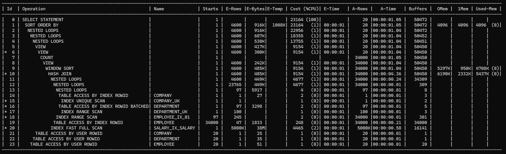
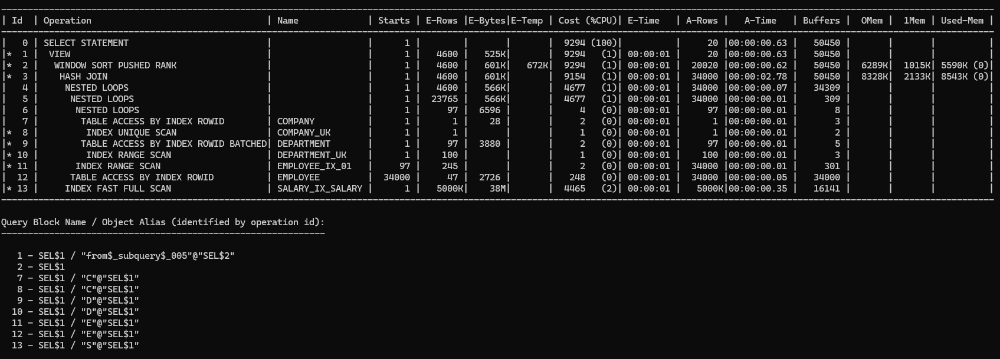
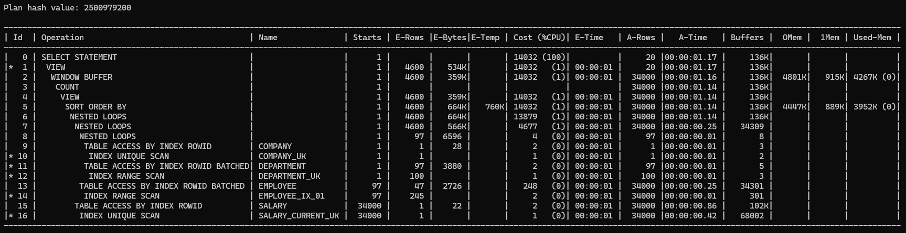
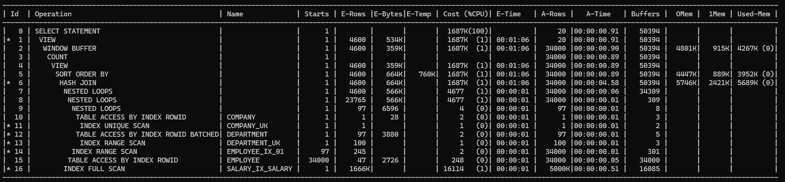

# Advanced Pagination

Pagination 방식 3가지 중 차이점이 있는 지 공부한 내용 정리.

> 본 내용은 **Pagination 설계 가이드**가 아닌, **고정된 스키마 위에서 옵티마이저가 실제로 뭘 하는 지 관찰한 실험 노트**에
> 더 가깝습니다.
> 
> 아울러 본 실험에 사용된 인덱스는 ddl.sql, 03-join, 05-sort 의 문제 해결 sql 에서 확인할 수 있습니다.
> (EMPLOYEE_IX_01, SALARY_IX_SALARY)

Topic:
> business_number = '0000000020' 에 대해서 아직 유효한 Department(status = 'ACTIVE') 의 모든
> 재직 중인 직원(employee.status = 'ACTIVE')들의 현재 Salary(end_date IS NULL) 정보를 조회한다.

조건:
* row-count 는 20 이고, page 는 1001 번째 페이지를 조회한다.

정렬:
* department_id
* hire_date
* base_salary DESC
* bonus DESC
* employee_key

## 고전적인 방식

```oracle
SELECT
    *
FROM (
     SELECT
         CEIL(ROWNUM / 20) AS page_no
          ,   CEIL((COUNT(*) OVER()) / 20) AS page_count
          ,   COUNT(*) OVER() AS row_count
          ,   MS.*
     FROM (
          SELECT
              c.company_name
               ,   d.department_id
               ,   d.department_name
               ,   e.employee_no
               ,   e.employee_name
               ,   e.hire_date
               ,   (CASE WHEN s.end_date IS NULL THEN s.base_salary END) AS base_salary
               ,   (CASE WHEN s.end_date IS NULL THEN s.bonus END) AS bonus
          FROM company    c
             ,department d
             ,employee   e
             ,salary     s
          WHERE c.business_number = '0000000020'
            AND d.company_key     = c.company_key
            AND d.status          = 'ACTIVE'
            AND e.department_key  = d.department_key
            AND e.status          = 'ACTIVE'
            AND (CASE WHEN s.end_date IS NULL THEN s.employee_key END) = e.employee_key
          ORDER BY d.department_id, e.hire_date, base_salary DESC, bonus DESC, e.employee_key
      ) MS
 ) SQ
WHERE page_no = 1001
   OR (page_count < 1001 AND page_count = page_no)
;
```

### 실행 계획
```oraclesqlplus
/*******************************************************************************
Plan hash value: 2500979200
 
-------------------------------------------------------------------------------------------------------------------------
| Id  | Operation                                   | Name              | Rows  | Bytes |TempSpc| Cost (%CPU)| Time     |
-------------------------------------------------------------------------------------------------------------------------
|   0 | SELECT STATEMENT                            |                   |  4600 |   534K|       | 14032   (1)| 00:00:01 |
|*  1 |  VIEW                                       |                   |  4600 |   534K|       | 14032   (1)| 00:00:01 |
|   2 |   WINDOW BUFFER                             |                   |  4600 |   359K|       | 14032   (1)| 00:00:01 |
|   3 |    COUNT                                    |                   |       |       |       |            |          |
|   4 |     VIEW                                    |                   |  4600 |   359K|       | 14032   (1)| 00:00:01 |
|   5 |      SORT ORDER BY                          |                   |  4600 |   664K|   760K| 14032   (1)| 00:00:01 |
|   6 |       NESTED LOOPS                          |                   |  4600 |   664K|       | 13879   (1)| 00:00:01 |
|   7 |        NESTED LOOPS                         |                   |  4600 |   566K|       |  4677   (1)| 00:00:01 |
|   8 |         NESTED LOOPS                        |                   |    97 |  6596 |       |     4   (0)| 00:00:01 |
|   9 |          TABLE ACCESS BY INDEX ROWID        | COMPANY           |     1 |    28 |       |     2   (0)| 00:00:01 |
|* 10 |           INDEX UNIQUE SCAN                 | COMPANY_UK        |     1 |       |       |     1   (0)| 00:00:01 |
|* 11 |          TABLE ACCESS BY INDEX ROWID BATCHED| DEPARTMENT        |    97 |  3880 |       |     2   (0)| 00:00:01 |
|* 12 |           INDEX RANGE SCAN                  | DEPARTMENT_UK     |   100 |       |       |     1   (0)| 00:00:01 |
|  13 |         TABLE ACCESS BY INDEX ROWID BATCHED | EMPLOYEE          |    47 |  2726 |       |   248   (0)| 00:00:01 |
|* 14 |          INDEX RANGE SCAN                   | EMPLOYEE_IX_01    |   245 |       |       |     2   (0)| 00:00:01 |
|  15 |        TABLE ACCESS BY INDEX ROWID          | SALARY            |     1 |    22 |       |     2   (0)| 00:00:01 |
|* 16 |         INDEX UNIQUE SCAN                   | SALARY_CURRENT_UK |     1 |       |       |     1   (0)| 00:00:01 |
-------------------------------------------------------------------------------------------------------------------------
 
Predicate Information (identified by operation id):
---------------------------------------------------
 
   1 - filter("PAGE_NO"=1001 OR "PAGE_COUNT"<1001 AND "PAGE_COUNT"="PAGE_NO")
  10 - access("C"."BUSINESS_NUMBER"='0000000020')
  11 - filter("D"."STATUS"='ACTIVE')
  12 - access("D"."COMPANY_KEY"="C"."COMPANY_KEY")
  14 - access("E"."DEPARTMENT_KEY"="D"."DEPARTMENT_KEY" AND "E"."STATUS"='ACTIVE')
  16 - access("E"."EMPLOYEE_KEY"=CASE  WHEN ("END_DATE" IS NULL) THEN "EMPLOYEE_KEY" END )
       filter(CASE  WHEN "END_DATE" IS NULL THEN "EMPLOYEE_KEY" END  IS NOT NULL)
*******************************************************************************/
```

## ROWID 기반으로 Random Access 를 최소화한 방식

```oracle
SELECT
    sq.page_no
     ,   sq.page_count
     ,   sq.row_count
     ,   c.company_name
     ,   d.department_id
     ,   d.department_name
     ,   e.employee_no
     ,   e.employee_name
     ,   e.hire_date
     ,   sq.base_salary
     ,   sq.bonus
FROM (
    SELECT /*+ no_merge */
        ms.rn
         ,   CEIL(ms.rn / 20) AS page_no
         ,   CEIL(ms.row_count / 20) AS page_count
         ,   ms.row_count
         ,   ms.c_rid
         ,   ms.d_rid
         ,   ms.e_rid
         ,   ms.base_salary
         ,   ms.bonus
    FROM (
         SELECT
             ROWNUM AS rn
              ,   x.*
         FROM (
              SELECT /*+ no_merge */
                  c0.ROWID AS c_rid
                   ,   d0.ROWID AS d_rid
                   ,   e0.ROWID AS e_rid
                   ,   COUNT(*) OVER() AS row_count
                   ,   d0.department_id AS sort_department_id
                   ,   e0.hire_date AS sort_hire_date
                   ,   e0.employee_key AS sort_employee_key
                   ,   (CASE WHEN s0.end_date IS NULL THEN s0.base_salary END) AS base_salary
                   ,   (CASE WHEN s0.end_date IS NULL THEN s0.bonus END) AS bonus
              FROM company    c0
                 ,department d0
                 ,employee   e0
                 ,salary     s0
              WHERE c0.business_number    = '0000000020'
                AND d0.company_key        = c0.company_key
                AND d0.status             = 'ACTIVE'
                AND e0.department_key     = d0.department_key
                AND e0.status             = 'ACTIVE'
                AND (CASE WHEN s0.end_date IS NULL THEN s0.employee_key END) = e0.employee_key
              ORDER BY d0.department_id
                     ,e0.hire_date
                     ,base_salary DESC
                     ,bonus DESC
                     ,e0.employee_key
          ) x
     ) ms
    WHERE CEIL(ms.rn / 20) = 1001
      OR (CEIL(ms.row_count / 20) < 1001
      AND CEIL(ms.row_count / 20) = CEIL(ms.rn / 20)
    )
) sq
, company c
, department d
, employee e
WHERE c.ROWID = sq.c_rid
  AND d.ROWID = sq.d_rid
  AND e.ROWID = sq.e_rid
ORDER BY sq.rn
;
```

### 실행 계획
```oraclesqlplus
/*******************************************************************************
Plan hash value: 1983787248
 
-----------------------------------------------------------------------------------------------------------------------------
| Id  | Operation                                        | Name             | Rows  | Bytes |TempSpc| Cost (%CPU)| Time     |
-----------------------------------------------------------------------------------------------------------------------------
|   0 | SELECT STATEMENT                                 |                  |  4600 |   916K|       | 14242   (1)| 00:00:01 |
|   1 |  SORT ORDER BY                                   |                  |  4600 |   916K|  1008K| 14242   (1)| 00:00:01 |
|   2 |   NESTED LOOPS                                   |                  |  4600 |   916K|       | 14034   (1)| 00:00:01 |
|*  3 |    HASH JOIN                                     |                  |  4600 |   687K|       |  9433   (1)| 00:00:01 |
|*  4 |     HASH JOIN                                    |                  |  4600 |   530K|       |  9162   (1)| 00:00:01 |
|   5 |      TABLE ACCESS FULL                           | COMPANY          |  1000 | 25000 |       |     8   (0)| 00:00:01 |
|   6 |      VIEW                                        |                  |  4600 |   417K|       |  9154   (1)| 00:00:01 |
|*  7 |       VIEW                                       |                  |  4600 |   300K|       |  9154   (1)| 00:00:01 |
|   8 |        COUNT                                     |                  |       |       |       |            |          |
|   9 |         VIEW                                     |                  |  4600 |   242K|       |  9154   (1)| 00:00:01 |
|  10 |          WINDOW SORT                             |                  |  4600 |   485K|       |  9154   (1)| 00:00:01 |
|* 11 |           HASH JOIN                              |                  |  4600 |   485K|       |  9154   (1)| 00:00:01 |
|  12 |            NESTED LOOPS                          |                  |  4600 |   449K|       |  4677   (1)| 00:00:01 |
|  13 |             NESTED LOOPS                         |                  | 23765 |   449K|       |  4677   (1)| 00:00:01 |
|  14 |              NESTED LOOPS                        |                  |    97 |  5917 |       |     4   (0)| 00:00:01 |
|  15 |               TABLE ACCESS BY INDEX ROWID        | COMPANY          |     1 |    27 |       |     2   (0)| 00:00:01 |
|* 16 |                INDEX UNIQUE SCAN                 | COMPANY_UK       |     1 |       |       |     1   (0)| 00:00:01 |
|* 17 |               TABLE ACCESS BY INDEX ROWID BATCHED| DEPARTMENT       |    97 |  3298 |       |     2   (0)| 00:00:01 |
|* 18 |                INDEX RANGE SCAN                  | DEPARTMENT_UK    |   100 |       |       |     1   (0)| 00:00:01 |
|* 19 |              INDEX RANGE SCAN                    | EMPLOYEE_IX_01   |   245 |       |       |     2   (0)| 00:00:01 |
|  20 |             TABLE ACCESS BY INDEX ROWID          | EMPLOYEE         |    47 |  1833 |       |   248   (0)| 00:00:01 |
|* 21 |            INDEX FAST FULL SCAN                  | SALARY_IX_SALARY |  5000K|    38M|       |  4465   (2)| 00:00:01 |
|  22 |     TABLE ACCESS FULL                            | DEPARTMENT       |   100K|  3417K|       |   271   (1)| 00:00:01 |
|  23 |    TABLE ACCESS BY USER ROWID                    | EMPLOYEE         |     1 |    51 |       |     1   (0)| 00:00:01 |
-----------------------------------------------------------------------------------------------------------------------------
 
Predicate Information (identified by operation id):
---------------------------------------------------
 
   3 - access("D".ROWID="SQ"."D_RID")
   4 - access("C".ROWID="SQ"."C_RID")
   7 - filter(CEIL("MS"."RN"/20)=1001 OR CEIL("MS"."ROW_COUNT"/20)<1001 AND 
              CEIL("MS"."ROW_COUNT"/20)=CEIL("MS"."RN"/20))
  11 - access(CASE  WHEN "END_DATE" IS NULL THEN "EMPLOYEE_KEY" END ="E0"."EMPLOYEE_KEY")
  16 - access("C0"."BUSINESS_NUMBER"='0000000020')
  17 - filter("D0"."STATUS"='ACTIVE')
  18 - access("D0"."COMPANY_KEY"="C0"."COMPANY_KEY")
  19 - access("E0"."DEPARTMENT_KEY"="D0"."DEPARTMENT_KEY" AND "E0"."STATUS"='ACTIVE')
  21 - filter(CASE  WHEN "END_DATE" IS NULL THEN "EMPLOYEE_KEY" END  IS NOT NULL)
*******************************************************************************/
```

## Native Pagination: Offset ~ FETCH 를 사용한 방법

```oracle
SELECT
    c.company_name
,   d.department_id
,   d.department_name
,   e.employee_no
,   e.employee_name
,   e.hire_date
,   (CASE WHEN s.end_date IS NULL THEN s.base_salary END) AS base_salary
,   (CASE WHEN s.end_date IS NULL THEN s.bonus END) AS bonus
FROM company    c
    ,department d
    ,employee   e
    ,salary     s
WHERE c.business_number = '0000000020'
  AND d.company_key     = c.company_key
  AND d.status          = 'ACTIVE'
  AND e.department_key  = d.department_key
  AND e.status          = 'ACTIVE'
  AND (CASE WHEN s.end_date IS NULL THEN s.employee_key END) = e.employee_key
ORDER BY d.department_id, e.hire_date, base_salary DESC, bonus DESC, e.employee_key
OFFSET (1000 * 20) ROWS FETCH NEXT 20 ROWS ONLY
;
```

### 실행 계획
```oraclesqlplus
/*******************************************************************************
Plan hash value: 2709459898
 
----------------------------------------------------------------------------------------------------------------------
| Id  | Operation                                 | Name             | Rows  | Bytes |TempSpc| Cost (%CPU)| Time     |
----------------------------------------------------------------------------------------------------------------------
|   0 | SELECT STATEMENT                          |                  |  4600 |   525K|       |  9294   (1)| 00:00:01 |
|*  1 |  VIEW                                     |                  |  4600 |   525K|       |  9294   (1)| 00:00:01 |
|*  2 |   WINDOW SORT PUSHED RANK                 |                  |  4600 |   601K|   672K|  9294   (1)| 00:00:01 |
|*  3 |    HASH JOIN                              |                  |  4600 |   601K|       |  9154   (1)| 00:00:01 |
|   4 |     NESTED LOOPS                          |                  |  4600 |   566K|       |  4677   (1)| 00:00:01 |
|   5 |      NESTED LOOPS                         |                  | 23765 |   566K|       |  4677   (1)| 00:00:01 |
|   6 |       NESTED LOOPS                        |                  |    97 |  6596 |       |     4   (0)| 00:00:01 |
|   7 |        TABLE ACCESS BY INDEX ROWID        | COMPANY          |     1 |    28 |       |     2   (0)| 00:00:01 |
|*  8 |         INDEX UNIQUE SCAN                 | COMPANY_UK       |     1 |       |       |     1   (0)| 00:00:01 |
|*  9 |        TABLE ACCESS BY INDEX ROWID BATCHED| DEPARTMENT       |    97 |  3880 |       |     2   (0)| 00:00:01 |
|* 10 |         INDEX RANGE SCAN                  | DEPARTMENT_UK    |   100 |       |       |     1   (0)| 00:00:01 |
|* 11 |       INDEX RANGE SCAN                    | EMPLOYEE_IX_01   |   245 |       |       |     2   (0)| 00:00:01 |
|  12 |      TABLE ACCESS BY INDEX ROWID          | EMPLOYEE         |    47 |  2726 |       |   248   (0)| 00:00:01 |
|* 13 |     INDEX FAST FULL SCAN                  | SALARY_IX_SALARY |  5000K|    38M|       |  4465   (2)| 00:00:01 |
----------------------------------------------------------------------------------------------------------------------
 
Predicate Information (identified by operation id):
---------------------------------------------------
 
   1 - filter("from$_subquery$_005"."rowlimit_$$_rownumber"<=20020 AND 
              "from$_subquery$_005"."rowlimit_$$_rownumber">20000)
   2 - filter(ROW_NUMBER() OVER ( ORDER BY "D"."DEPARTMENT_ID","E"."HIRE_DATE",CASE  WHEN "END_DATE" IS NULL 
              THEN "BASE_SALARY" END  DESC ,CASE  WHEN "END_DATE" IS NULL THEN "BONUS" END  DESC 
              ,"E"."EMPLOYEE_KEY")<=20020)
   3 - access("E"."EMPLOYEE_KEY"=CASE  WHEN ("END_DATE" IS NULL) THEN "EMPLOYEE_KEY" END )
   8 - access("C"."BUSINESS_NUMBER"='0000000020')
   9 - filter("D"."STATUS"='ACTIVE')
  10 - access("D"."COMPANY_KEY"="C"."COMPANY_KEY")
  11 - access("E"."DEPARTMENT_KEY"="D"."DEPARTMENT_KEY" AND "E"."STATUS"='ACTIVE')
  13 - filter(CASE  WHEN "END_DATE" IS NULL THEN "EMPLOYEE_KEY" END  IS NOT NULL)
*******************************************************************************/
```

## 실행계획 분석

ROWID 방식의 실행 계획을 보면, Predicate 상으로는 분명 ROWID 로 Join 을 걸고 있지만,\
옵티마이저는 Table Access Full 을 선택한 모습을 볼 수 있다.

```
...
|*  4 |     HASH JOIN                                    |                  |  4600 |   530K|       |  9162   (1)| 00:00:01 |
|   5 |      TABLE ACCESS FULL                           | COMPANY          |  1000 | 25000 |       |     8   (0)| 00:00:01 |
|   6 |      VIEW                                        |                  |  4600 |   417K|       |  9154   (1)| 00:00:01 |
|*  7 |       VIEW                                       |                  |  4600 |   300K|       |  9154   (1)| 00:00:01 |
...
   4 - access("C".ROWID="SQ"."C_RID")
   7 - filter(CEIL("MS"."RN"/20)=1001 OR CEIL("MS"."ROW_COUNT"/20)<1001 AND 
       CEIL("MS"."ROW_COUNT"/20)=CEIL("MS"."RN"/20))
...
```

아무래도 옵티마이저가 판단하기를 Company 테이블과 ROWID 로 이루어진 View 를 Join 할 때,\
통계자료 상 1000 Rows 밖에 없는 Company 를 전부 읽어 Hashing 을 하고 처리하는 것이 더 효과적일 것으로 판단할 것으로 보인다.

여기서 확인해볼 필요가 있는 지점은 ID 6번인 View Operator 의 ID 7번은 Predicate 상 20개의 행만 조회하는 필터 작업을 수행한다.\
즉, 6번의 행은 겨우 20 rows 뿐이다. 

또한 ROWID 로 Join 하는 방식의 경우, 직접 Block 으로 접근하는 방식이기 때문에 사실상 카디널리티는 1이고 횟수는 20번이니,
Cost 는 아무리 높게 측정되더라도 20 정도로 잡히는 것이 일반적이겠으나\
옵티마이저는 이를 4600 행이 그대로 반출이 되어 그만큼의 I/O 비용이 발생할 것이라고 본 것이다.

### 힌트로 실행계획 변경

TABLE ACCESS BY USER ROWID 으로 유도하는 것이 가장 이상적이다.\
이유는 inner table 의 row 수가 매우 작고 (20행), ROWID 로 Join 을 하는 방식이 불필요한 block 을 최소한으로 읽을 수 있기 때문이다.

그렇기에 가장 바깥에 있는 SELECT 절에 다음 힌트를 추가하였다.
```oracle
SELECT /*+ ordered use_nl(c d e) */
...
```

실행계획은 ROWID 로 모두 access 방식이 변경되었다.
```oraclesqlplus
/*******************************************************************************
Plan hash value: 3703695334
 
-----------------------------------------------------------------------------------------------------------------------------
| Id  | Operation                                        | Name             | Rows  | Bytes |TempSpc| Cost (%CPU)| Time     |
-----------------------------------------------------------------------------------------------------------------------------
|   0 | SELECT STATEMENT                                 |                  |  4600 |   916K|       | 23164   (1)| 00:00:01 |
|   1 |  SORT ORDER BY                                   |                  |  4600 |   916K|  1008K| 23164   (1)| 00:00:01 |
|   2 |   NESTED LOOPS                                   |                  |  4600 |   916K|       | 22956   (1)| 00:00:01 |
|   3 |    NESTED LOOPS                                  |                  |  4600 |   687K|       | 18355   (1)| 00:00:01 |
|   4 |     NESTED LOOPS                                 |                  |  4600 |   530K|       | 13755   (1)| 00:00:01 |
|   5 |      VIEW                                        |                  |  4600 |   417K|       |  9154   (1)| 00:00:01 |
|*  6 |       VIEW                                       |                  |  4600 |   300K|       |  9154   (1)| 00:00:01 |
...
|  21 |      TABLE ACCESS BY USER ROWID                  | COMPANY          |     1 |    25 |       |     1   (0)| 00:00:01 |
|  22 |     TABLE ACCESS BY USER ROWID                   | DEPARTMENT       |     1 |    35 |       |     1   (0)| 00:00:01 |
|  23 |    TABLE ACCESS BY USER ROWID                    | EMPLOYEE         |     1 |    51 |       |     1   (0)| 00:00:01 |
-----------------------------------------------------------------------------------------------------------------------------

Predicate Information (identified by operation id):
---------------------------------------------------

   6 - filter(CEIL("MS"."RN"/20)=1001 OR CEIL("MS"."ROW_COUNT"/20)<1001 AND 
       CEIL("MS"."ROW_COUNT"/20)=CEIL("MS"."RN"/20))
 */
```

기존 실행계획보다는 Cost 가 더 많이 사용될 것이라고 옵티마이저는 판단하였는 데, 이는 앞서 설명한 5, 6 ID 에서 
옵티마이저가 잘못 판단하여 카디널리티가 매우 높을 것이라고 판단하였기 때문이다. \
(Outer table 이 4600 행, inner table 이 1행으로 판단했으니, I/O 가 그만큼 많이 발생할 것으로 판단했기 때문이다.)

### Gather Plan Statistic 힌트로 확인

이러한 점이 사실인지를 확인하기 위해 Gather Plan Statistic 힌트로 확인해보았다. 다음 스크린샷은 ROWID 를 Nested Loops 로 변경했을 때의 결과다.



A-Rows(실제 조회한 Row 수) 는 예측한 대로 20 행이다.

## OFFSET 쿼리의 Trace 확인

> 동일하게 Gather Plan Statistic 힌트로 확인하였습니다.



Offset 을 활용한 쿼리도 view 를 만드는 것까지는 정확하게 동일하다.\
Buffers(논리적 Block 의 수를 의미. 옵티마이저가 일한 총량을 의미.) 가 다음과 같아서 정확하게 일치한다.

| OPERATION      | OFFSET | ROWID  |
|----------------|--------|--------|
| COMPANY        | 3      | 3      |
| DEPARTMENT     | 5      | 5      |
| EMPLOYEE INDEX | 301    | 301    |
| EMPLOYEE TABLE | 34,000 | 34,000 |
| SALARY INDEX   | 16,141 | 16,141 |

### 차이점

다만, OFFSET 을 사용한 쪽이 더 세련되게 동작한다.

ROWID 방식은 `WINDOW SORT + A-Rows 가 34,000` 으로, 전체 결과를 Sort 하고 `COUNT(*) OVER()` 까지 계산하는 데,\
OFFSET 은 페이지 수나 페이지 번호 등과 같은 정보를 조회하지 않기 때문에 `WINDOW SORT PUSHED RANK` 으로\
Optimizer 가 pagination 조건을 sort 안으로 밀어넣은 방식이다.

즉, Candidate(후보) 는 34,000 건으로 둘 다 동일했지만, sort 결과를 유지할 필요가 있는 것은 대략 20,020 건 뿐인데,\
(20 개씩 * 1000 페이지 스킵이므로 20000 건은 스킵 대상이고, 20개는 현재 조회해야할 대상이다.)\
이를 구조적인 차이를 통해 최적화를 했다는 것을 알 수 있다.

> 페이지 정보를 OFFSET 원-쿼리에서 조회했다면, ROWID 방식과 더 유사했을 것이다.\
> 현재 ROWID 와의 차이는 Buffers 수가 41 건 더 적게 사용(페이지 정보에 대한 비용)하는 것과\
> 구조적 최적화를 했다는 점이다.

## 고전적인 방식의 Trace 확인

> 동일하게 Gather Plan Statistic 힌트로 확인하였습니다.



위 정보를 통해 더 명확하게 알 수 있는 점은 명확하다.\
똑같은 Candidate(후보) 수 지만, 이를 전부 SORT ORDER BY, VIEW, COUNT, WINDOW BUFFER 에 그대로 사용되었다는 점이다.

즉, 34,000 건을 모두 완성시킨 후 마지막 20건만 남기는 방식으로 비효율적인 면모가 보인다.

### 고전적인 방식의 병목

하지만 고전적인 방식에는 (다른 실행계획들과의 차이) 병목이 존재한다.\
Salary 테이블에 접근을 할 때 수직적 탐색을 하는 `INDEX UNIQUE SCAN` 방식이 사용되고 있다.

Starts(해당 Operation 을 수행한 횟수) 로 보았을 때 정확히 Employee 의 A-Rows 수(=34,000) 만큼 수행되었음을 알 수 있다.\
즉, 34,000 회만큼의 Table Access 가 발생되었다는 뜻이고, 특히 index 만 본다면 Starts = 34,000 / Buffers = 68,002 라는 점을 미루어보아 대충 한 probe 에 2 block 정도를 계속 건드리는 형태라는 점을 볼 수 있다. 

다른 실행계획들과의 가장 큰 차이점은 다른 실행계획들은 Salary 테이블 접근 방식이 INDEX_FFS (Index Fast Full Scan) 이라는 점이다. 그리고 Salary(buffers: 16,141) 와 Employee(buffers: 34,309) 를 Hash Join 으로 50,450 만으로 끝내버린다는 점이다.

> 정리하자면, 5백만 건을 통채로 읽는 편이 34,000 건을 일일이 찾는 쪽보다 훨씬 싸다는 점이다.

단순히 실행계획만을 두고 보게된다면, 고전적 방식은 Salary 34,000 건을 찾는 방식이고\
ROWID/OFFSET 방식은 Salary Index 5,000,000 건을 읽는다.

이 점만 본다면, 고전적 방식이 당연히 좋아보이겠으나, block 단위에서는 그렇지 않다.\
고전적인 방식은 34,000 * (B-Tree 수직 탐색 + Table Random Access) 이라는 점이고(=Salary branch 약 102K buffers),\
ROWID/OFFSET 방식은 Salary index leaf blocks 를 처음부터 끝까지 multiblock I/O 로 한 번 읽는다는 점이다(=16,141 buffers).

> 즉, row 수보다 block access pattern 이 더 중요하다는 사례 중 하나다.

### 고전적인 방식의 개선 여지

쿼리 구조상 INDEX_FFS 를 유도할 수 없었다. (인덱스 구조상의 유도가 안됨)\
대신, INDEX_FS (Index Full Scan) 은 유도가 가능했다.

```oracle
SELECT 
    *
FROM (
    SELECT 
        CEIL(ROWNUM / 20) AS page_no
    ,   CEIL((COUNT(*) OVER()) / 20) AS page_count
    ,   COUNT(*) OVER() AS row_count
    ,   MS.*
    FROM (
        SELECT /*+ USE_HASH(s) INDEX(s SALARY_IX_SALARY) */
            c.company_name
        ,   d.department_id
        ,   d.department_name
        ,   e.employee_no
        ,   e.employee_name
        ,   e.hire_date
        ,   (CASE WHEN s.end_date IS NULL THEN s.base_salary END) AS base_salary
        ,   (CASE WHEN s.end_date IS NULL THEN s.bonus END) AS bonus
        FROM company    c
            ,department d
            ,employee   e
            ,salary     s
        WHERE c.business_number = '0000000020'
          AND d.company_key     = c.company_key
          AND d.status          = 'ACTIVE'
          AND e.department_key  = d.department_key
          AND e.status          = 'ACTIVE'
          AND (CASE WHEN s.end_date IS NULL THEN s.employee_key END) = e.employee_key
        ORDER BY d.department_id, e.hire_date, base_salary DESC, bonus DESC, e.employee_key
    ) MS
) SQ
WHERE page_no = 1001
  OR (page_count < 1001 AND page_count = page_no)
;
```

**실행 계획**

```oraclesqlplus
/*******************************************************************************
Plan hash value: 3349804893
 
-------------------------------------------------------------------------------------------------------------------------
| Id  | Operation                                    | Name             | Rows  | Bytes |TempSpc| Cost (%CPU)| Time     |
-------------------------------------------------------------------------------------------------------------------------
|   0 | SELECT STATEMENT                             |                  |  4600 |   534K|       |  1687K  (1)| 00:01:06 |
|*  1 |  VIEW                                        |                  |  4600 |   534K|       |  1687K  (1)| 00:01:06 |
|   2 |   WINDOW BUFFER                              |                  |  4600 |   359K|       |  1687K  (1)| 00:01:06 |
|   3 |    COUNT                                     |                  |       |       |       |            |          |
|   4 |     VIEW                                     |                  |  4600 |   359K|       |  1687K  (1)| 00:01:06 |
|   5 |      SORT ORDER BY                           |                  |  4600 |   664K|   760K|  1687K  (1)| 00:01:06 |
|*  6 |       HASH JOIN                              |                  |  4600 |   664K|       |  1687K  (1)| 00:01:06 |
|   7 |        NESTED LOOPS                          |                  |  4600 |   566K|       |  4677   (1)| 00:00:01 |
|   8 |         NESTED LOOPS                         |                  | 23765 |   566K|       |  4677   (1)| 00:00:01 |
|   9 |          NESTED LOOPS                        |                  |    97 |  6596 |       |     4   (0)| 00:00:01 |
|  10 |           TABLE ACCESS BY INDEX ROWID        | COMPANY          |     1 |    28 |       |     2   (0)| 00:00:01 |
|* 11 |            INDEX UNIQUE SCAN                 | COMPANY_UK       |     1 |       |       |     1   (0)| 00:00:01 |
|* 12 |           TABLE ACCESS BY INDEX ROWID BATCHED| DEPARTMENT       |    97 |  3880 |       |     2   (0)| 00:00:01 |
|* 13 |            INDEX RANGE SCAN                  | DEPARTMENT_UK    |   100 |       |       |     1   (0)| 00:00:01 |
|* 14 |          INDEX RANGE SCAN                    | EMPLOYEE_IX_01   |   245 |       |       |     2   (0)| 00:00:01 |
|  15 |         TABLE ACCESS BY INDEX ROWID          | EMPLOYEE         |    47 |  2726 |       |   248   (0)| 00:00:01 |
|* 16 |        INDEX FULL SCAN                       | SALARY_IX_SALARY |  1666K|       |       | 16114   (1)| 00:00:01 |
-------------------------------------------------------------------------------------------------------------------------
 
Predicate Information (identified by operation id):
---------------------------------------------------
 
   1 - filter("PAGE_NO"=1001 OR "PAGE_COUNT"<1001 AND "PAGE_COUNT"="PAGE_NO")
   6 - access("E"."EMPLOYEE_KEY"=CASE  WHEN ("END_DATE" IS NULL) THEN "EMPLOYEE_KEY" END )
  11 - access("C"."BUSINESS_NUMBER"='0000000020')
  12 - filter("D"."STATUS"='ACTIVE')
  13 - access("D"."COMPANY_KEY"="C"."COMPANY_KEY")
  14 - access("E"."DEPARTMENT_KEY"="D"."DEPARTMENT_KEY" AND "E"."STATUS"='ACTIVE')
  16 - filter(CASE  WHEN "END_DATE" IS NULL THEN "EMPLOYEE_KEY" END  IS NOT NULL)
*******************************************************************************/
```

#### 다시 Trace 확인



이제 고전적인 방식 역시 ROWID/OFFSET 와 Buffers 측면에서는 사실상 동일해졌다.
* 고전적인 방식 + HASH: 50,394
* ROWID: 50,491
* OFFSET: 50,450

## 요약

### 고전적인 방식

고전적인 방식을 사용하는 데에 있어서 최적화 포인트는 Join 및 Table 접근 최적화다.

```
NL + 34K index probes
136K buffers

->

HASH + index scan
50K buffers
```

logical I/O 절감에 있어서는 Join 최적화가 가장 효과적이다고 볼 수 있다.

### ROWID 방식

ROWID 방식을 사용하는 데에 있어서 최적화 포인트는 **Late Materialization** 이다.

```
고전적인 방식: 34K full projection (모두 Sort, Count 하므로)
vs
ROWID: 34K narrow projection + 20 final projection
```

Buffers 차이는 거의 없지만, CPU/sort 대상으로 들어가는 데이터 구조가 달라졌기에 이에 대한 최적화가 되었다.

### OFFSET 방식

```
ROWID: WINDOW SORT -> 34K
vs
OFFSET: WINDOW SORT PUSHED RANK -> 20,020 
```

OFFSET 은 전체 Count 가 필요없으니 Optimizer 가 `OFFSET + FETCH` 를 알고 상위 N 까지만 유지할 수 있어 최적화가 되었다.

### 정리하자면...

ROWID 가 I/O 를 마법처럼 1/3 으로 줄인 것이 아닌, JOIN 방식이 I/O 를 크게 줄였고, ROWID 는 그 이후의 row-processing 을 줄이는 별도의 최적화였다.

즉, 다음과 같이 정리할 수 있다.

> 성능을 만든 것은 문법이 아니라, 언제 row 를 완성하고 언제 table block 에 접근하며 Optimizer 가 몇 건까지 필요하다는 사실을 알고 있느냐에 따라 달라진다.
> 또, 세 방식 모두 34,000 건 후보를 못 줄인다. 줄일 수 없는 이유는 문법이 아니라 정렬 키가 조인 경계를 넘기 때문이다.
> offset 의 근본 비용은 스키마가 결정한다.
